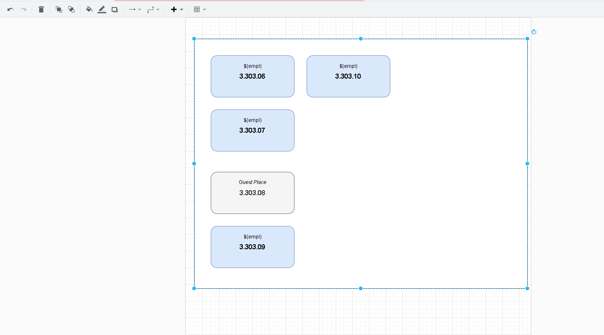
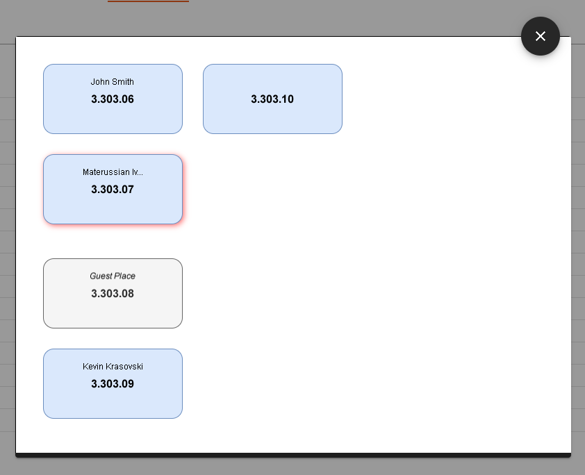

# Create new map for office workplace

1. Install and run Draw.IO 
2. Enable `plugins/svgdata.js` plugin. (probable you have to run `draw.io.exe --enable-plugins`) 
3. Load `hreasy_workplace.xml` library
4. Draw your office location map and add workplaces from library
5. For every workplace open edit dialog (double click) and set `workplaceName` property
6. Export as svg

7. In HR Easy open dictionary admin page and select office workplaces
8. Upload svg map
9. In Employee admin page populate office location property and workplace property
