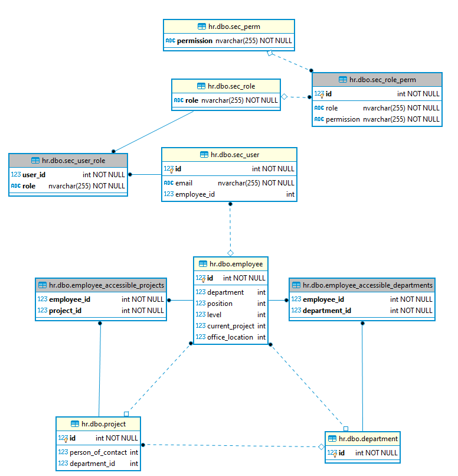
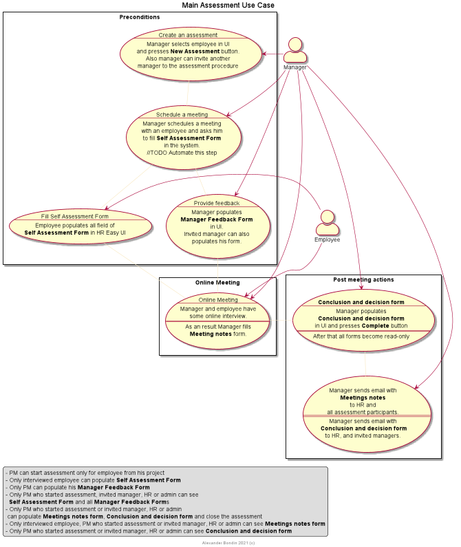

# HREasy - HR Portal for STM Internal Uses

@author Alexander Bondin 2019-2023

[](https://github.com/abondin/hreasy/actions/workflows/main.yml)

# Key features

- Auth with internal DB password and LDAP
- Show all employees
- View/Add/Approve Overtimes
- View/Add/Update Vacations
- Admin employees
- Import employees from Excel
- Admin all dictionaries
- Admin projects
- Admin Business Accounts
- Admin user roles
- Articles (news and shared information).
- Assessments
- Notifications
  - Upcoming vacations email
- Download and upload Technical Profiles


## Permissions and roles



Security model based on main entity - Employee:

Employee may have access to the actions for employees, currently assigned to the specific
project. Or to the actions for employees,
currently assigned to any project from specific business account,
currently assigned to any project from specific department.
Permissions depended on
`employee_accessible_departments`,
`employee_accessible_bas`,
and `employee_accessible_projects` marked in the table bellow.

Many permissions are always allowed the currently logged in employee. Also marked in the permission table.

*For example*: we have employee *John* with accessible project *Project1* and role with permission *overtime_view*. Also
we have employee *Dave* without any role currently assigned to the *Project1*. In that case John can see his overtimes
and Dave's overtimes. Dave can see only his own overtimes.

- List of permissions are code based. Database table must be always in sync with backend and frontend code.
- Set of permissions combined to the role. List of roles is code independent and can be updated in database (and in
  admin UI in future releases). See `sec_role` and `sec_role_perm` tables.
- Roles assigned to the user in `sec_user_role` in admin UI.

**List of supported permissions**:

|permission|depends on department|always available to oneself|always available to project/ba manager| description                                                                                                                                                      |
|----|------|------|-------------------------------------------------------------------------------------------------------------------------------------------------------------------|
|update_current_project_global|N|N|N| Change current employee project                                                                                                                                   |
|update_current_project|Y|N|Y| Update current project for employee from my projects or my departments                                                                                            |
|update_avatar|N|N|N| Update employee avatar                                                                                                                                            |
|overtime_view|N|Y|Y| View overtimes of given employee                                                                                                                                  |
|overtime_edit|Y|Y|Y| Edit and approve overtimes of given employee                                                                                                                      |
|overtime_admin|N|N|N| Admin overtime configuration. Close overtime period and other stuff                                                                                               |
|vacation_view|Y|Y|Y| View vacations of given employee                                                                                                                                  |
|vacation_edit|Y|Y|Y| View vacations of given employee                                                                                                                                  |
|project_admin_area|N|N|N| Access to project admin area in UI                                                                                                                                |
|update_project_globally|N|N|N| Admin permission to update information of any project. Without this permission user can update only projects created by himself or with update_project permission |
|update_project|Y|Y|Y| Admin project if employee is project/ba/department manager                                                                                                        |
|create_project|N|N|N| Admin permission to create new project                                                                                                                            |
|admin_users|N|N|N| Admin user. Assign roles. Assign accessible projects and departments                                                                                              |
|edit_skills|Y|Y|Y| Add/Delete employee skills of managed project/department                                                                                                          |
|edit_business_account|N|N|N| Add/Update business account and create/update BA positions                                                                                                        |
|assign_to_ba_position|Y|N|N| Assign employee to business account position                                                                                                                      |
|edit_articles|N|N|N| Create, update and moderate articles and news                                                                                                                     |
|edit_employee_full|N|N|N| Create/update employee                                                                                                                                            |
|import_employee|N|N|N| Import employees from file                                                                                                                                        |
|view_employee_full|N|N|N| View employee all fields including personal                                                                                                                       |
|view_assessment_full|N|N|Y| View all assessment forms without restrictions                                                                                                                    |
|create_assessment|N|N|Y| View last assessment date for employee. Schedule new assessment and invite managers                                                                               |
|admin_notifications|N|N|N| Create notifications for the employees                                                                                                                            |
|techprofile_download|Y|Y|Y| Download employee's tech profile                                                                                                                                  |
|techprofile_upload|Y|Y|Y| Upload or delete employee's tech profile                                                                                                                          |
|admin_department|N|N|N| Create/update/delete department                                                                                                                                   |
|admin_level|N|N|N| Create/update/delete employee overall skills level                                                                                                                |
|admin_position|N|N|N| Create/update/delete employee position                                                                                                                            |
|admin_office_location|N|N|N| Create/update/delete office location                                                                                                                              |
|view_empl_current_project_role|Y|Y|Y| View current project role                                                                                                                                         |
|view_empl_skills|Y|Y|Y| View employee skills                                                                                                                                              |
|admin_managers|N|N|N| Admin managers for department,ba,project employees                                                                                                                |

**Default permissions and roles**

|role|description|
|----|------|
|global_admin|Full access|
|hr|Add/Update/Fire all employees. Admin dictionary|
|pm|Overtime and vacation review and update, reasign employee between managed projects|
|finance|Work with business account positions and expenses|
|content_management|Create, update and moderate articles and news|

| permissions                   |roles|
|-------------------------------|------|
| update_current_project_global |global_admin, hr|
| update_current_project        |global_admin, hr, pm|
| update_avatar                 |global_admin, hr|
| overtime_view                 |global_admin, hr, pm|
| overtime_edit                 |global_admin, hr, pm|
| overtime_admin                |global_admin|
| vacation_view                 |global_admin, hr, pm|
| vacation_edit                 |global_admin, hr, pm|
| project_admin_area            |global_admin,pm|
| update_project_globally       |global_admin|
| update_project                |pm|
| create_project                |global_admin, pm|
| admin_users                   |global_admin|
| edit_skills                   |global_admin,pm,hr|
| edit_business_account         |global_admin,finance|
| assign_to_ba_position         |global_admin,pm,finance|
| edit_articles                 |global_admin,content_management|
| edit_employee_full            |global_admin,hr|
| import_employee               |global_admin,hr|
| view_employee_full            |global_admin,hr|
| view_assessment_full          |global_admin,hr|
| create_assessment             |pm,global_admin,hr|
| techprofile_download          |pm,global_admin,hr|
| techprofile_upload            |pm,global_admin,hr|
| admin_department              |global_admin,hr|
| admin_level                   |global_admin,hr|
| admin_position                |global_admin,hr|
| admin_office_location         |global_admin,hr|
| admin_managers                |global_admin,hr|

## Assessments

Project Manager in UI able to select employee and schedule an assessment.
The goal of this functionality
- help PMs and HR to keep in sync employees attitude to work



**Assessments form template (WIP)**

Assessment form based on JSON template. System Administrator can update template for every form type
in database table `assessment_form_template` (*//TODO Admin page to edit template*):
* `form_type` - type of the form. Possible values:
    * 1 - self assessment
    * 2 - manager feedback
    * 3 - meeting notes
    * 4 - conclusion and decision
* `content` - template in JSON format. JSON structure:
    * `groups` [] - array of form fields groups
        * `key` - system key (code) of the group
        * `displayName` - Display Name of the group (for UI)
        * `(?) description` - Text for UI details tooltip
        * `fields` [] - array of the fields of the group
            * `key` - system key (code) of the field
            * `displayName` - Display Name of the field (for UI)
            * `(?) description` - Text for UI details tooltip
            * `type` - Helps UI to render field on the form. Possible values:
                * `short_text_with_rate` - UI show two fields.
                  1 - single line text field for open comment
                  2 - rate from 1 to 10
                * `text` - multiline text area


## Technical Profiles

Employee (or HR/PM/Admin) can upload a technical profile documents.


## Managers

* In 1.2.0 new functionality to deal with Department, Business Account and project
  responsible employees added.
* Manager can be technical, organization or HR lead on project/ba/department (**object** in terms of responsibility feature).
* Business account, department or project may have several managers
* Before 1.2.0 we had only one responsible employee on Business Account. No managers for project. No manager for department.

### Goals

* Show every employee on project his managers' matrix (project leads, ba leads, head of the department)
* Notify managers on events (see [notifications](#notifications))

### Architecture flaws

* Some kind of functionality overlap with
# Development

## Projects

 - portal - monolite backend
 - web - Vue JS Single Page Application

## Technologies Stack

 - Java on backend
 - PostgreSQL as database
 - Spring Reactive
 - Vue + vuetifyjs + ts on frontend
 
## Local build

```shell script
export DOCKER_REPOSITORY=<Your Repository> (optional)
export CI_DEPLOY_TAG=latest (optional)
./devops/build.sh
```

## Local run in Docker-compose

Docker Compose file is located in `.hreasy-localdev`

```shell script
cd .hreasy-localdev
docker-compose up -d
```

*Tip* The following command pulls and updates single services

```shell script
sudo docker pull docker.io/abondin/hreasyplatform:latest
sudo docker pull docker.io/abondin/hreasyweb:latest
sudo /usr/local/bin/docker-compose up -d --no-deps --force-recreate --build hreasyplatform hreasyweb
```

## Notifications

Notifications can be sent from admin web UI (not implemented)

or by system event (not implemented).
HR Easy supports several notification delivery channels:
- 0 - Web UI - show notification in UI (with ack and archive functionality)
- 1 - Email - send notification to mail

### Email messages background jobs:

|Job|Schedule|Actions|
|----|------|-----|
|upcoming_vacations|fixedDelay 1 hour|Sends email to employee with up to 3 weeks upcoming vacations|

### Upcoming vacations email

HR Easy automatically sends one email for every upcoming vacation (vacation, which will be started in up to 3 weeks)

Email recipients:
* (to) employee
* (cc) all not fired employee's project managers
* (cc) all not fired managers of project's business account
* (cc) all not fired managers of project's department
* (cc) Additional emails from `HREASY_BACKGROUND_UPCOMING-VACATION_ADDITIONAL-EMAIL-ADDRESSES` env variable
