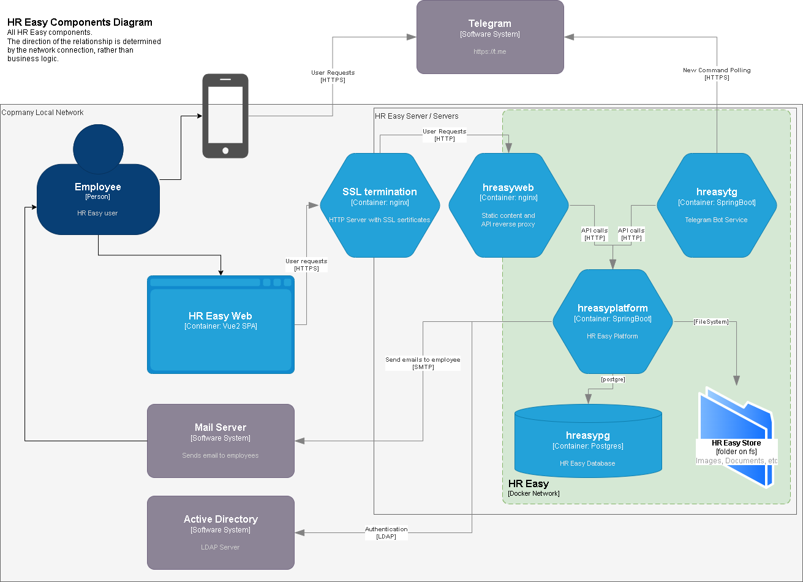
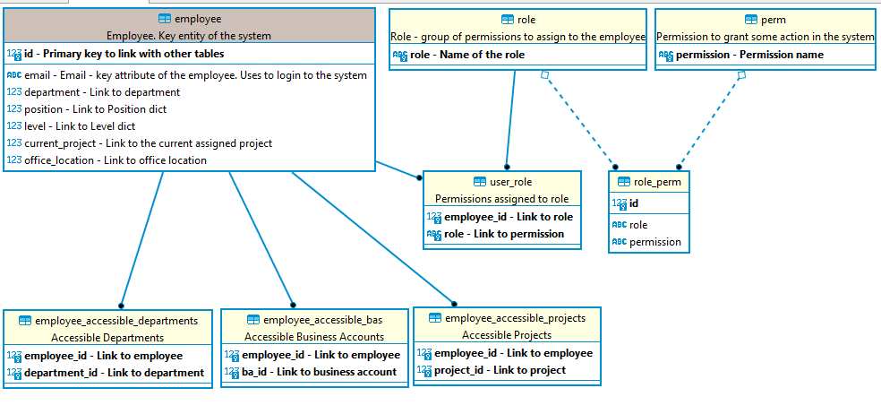
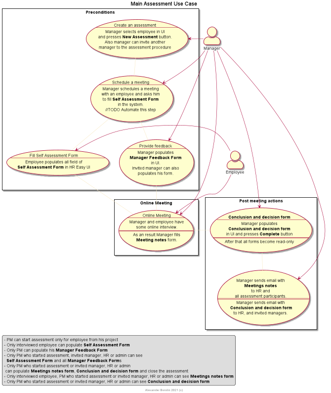
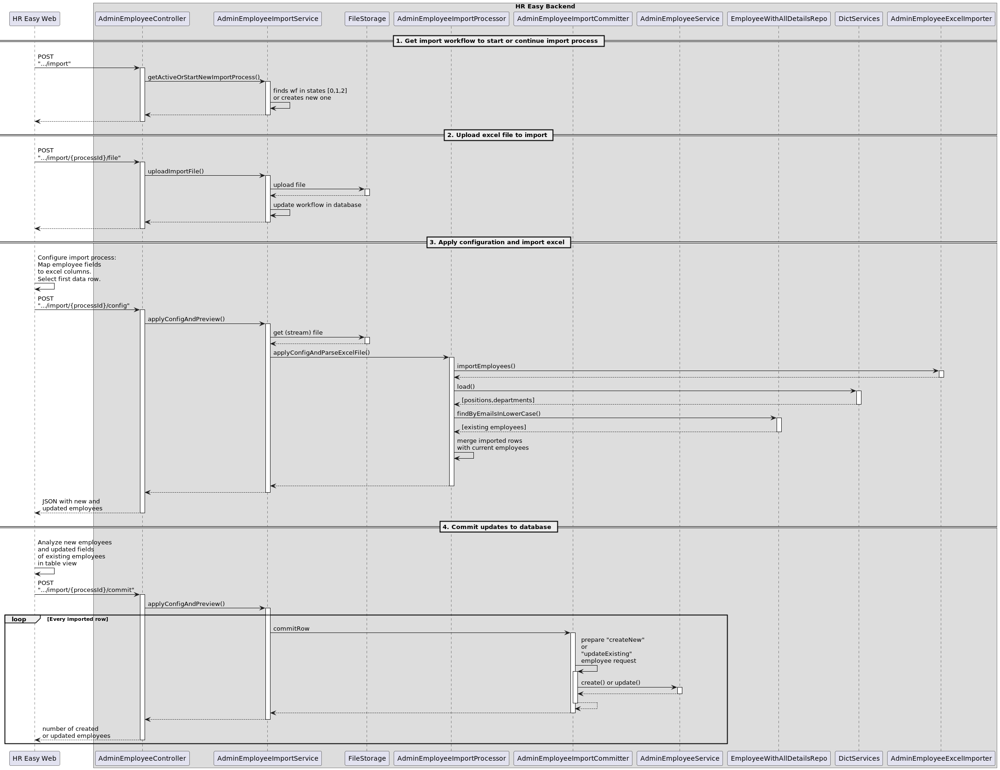

# HREasy - HR Portal for STM Internal Uses

@author Alexander Bondin 2019-2026

[](https://github.com/abondin/hreasy/actions/workflows/main.yml)

# Key features

- Auth with internal DB password and LDAP
- Show all employees
- View/Add/Approve Overtimes
- View/Add/Update Vacations
- Admin employees
- Import employees from Excel
- Admin all dictionaries
- Admin projects
- Admin Business Accounts
- Admin user roles
- Articles (news and shared information).
- Assessments
- Notifications
    - UI inbox notifications
    - Yandex Messenger delivery through Notify MS
    - Upcoming vacations email
- Download and upload Technical Profiles
- Report, Implement and export salaries requests and bonuses
- Junior and mentors registry
- Upload office location map. See [instruction](.docs/create_ofiice_workplace_map.md)

## Architecture overview



## Telegram Bot

**Deprecated / outdated.** [Telegram Bot](./backend/telegram/Readme.md) is a legacy additional user interaction interface with
HR Easy Platform. It is not the target architecture for new notification delivery features and is expected to be
redesigned separately.

## Notification Delivery Service

[Notify MS](./backend/notify-ms/README.md) is a separate notification delivery service. It accepts normalized notification
requests from HR Easy Platform and delivers them through external channels such as Yandex Messenger.

## Permissions and roles



Security model based on main entity - Employee:

Employee may have access to the actions for employees, currently assigned to the specific
project. Or to the actions for employees,
currently assigned to any project from specific business account,
currently assigned to any project from specific department.
Some permissions depend on
`employee_accessible_departments`,
`employee_accessible_bas`,
and `employee_accessible_projects`; these permissions are described as manager-scoped below.

Some operations are always allowed for the currently logged in employee even without a matching role permission.
Those cases are enforced in backend validators and called out in the permission descriptions.

*For example*: we have employee *John* with accessible project *Project1* and role with permission *overtime_view*. Also
we have employee *Dave* without any role currently assigned to the *Project1*. In that case John can see his overtimes
and Dave's overtimes. Dave can see only his own overtimes.

- List of permissions are code based. Database table must be always in sync with backend and frontend code.
- Set of permissions combined to the role. List of roles is code independent and can be updated in database (and in
  admin UI in future releases). See `sec_role` and `sec_role_perm` tables.
- Roles assigned to the user in `sec_user_role` in admin UI.

**List of supported permissions**:

The backend is the source of truth. This table is based on Flyway permissions under `sec.perm` and backend security
validators. "Manager-scoped" means access is limited by `sec.employee_accessible_projects`,
`sec.employee_accessible_bas`, and `sec.employee_accessible_departments`.

| permission                     | backend rule / scope                                                                                  |
|--------------------------------|--------------------------------------------------------------------------------------------------------|
| `access_junior_reg`            | View junior registry within backend junior registry rules: admin, accessible registry records, mentor, or creator cases. |
| `admin_department`             | Create/update/delete departments.                                                                     |
| `admin_junior_reg`             | View, modify, export, and administer any junior registry record.                                       |
| `admin_level`                  | Create/update/delete employee levels.                                                                 |
| `admin_managers`               | View and administer managers for departments, business accounts, and projects.                         |
| `admin_notifications`          | Create manual employee notifications from admin functionality.                                         |
| `admin_office`                 | Create/update/delete offices.                                                                         |
| `admin_office_location`        | Create/update/delete office locations.                                                                |
| `admin_office_map`             | Upload and delete office and office location maps.                                                     |
| `admin_organization`           | Create/update/delete organizations.                                                                   |
| `admin_position`               | Create/update/delete employee positions.                                                              |
| `admin_salary_request`         | View and administer all salary requests, close salary request periods, and bypass salary request ownership checks. |
| `admin_users`                  | View and update employee security settings: roles and accessible projects, BAs, departments.           |
| `approve_salary_request`       | Approve salary requests for accessible budgeting business accounts; also participates in salary request visibility. |
| `assign_to_ba_position`        | Assign or unassign employees to business account positions.                                            |
| `create_assessment`            | View short assessment info, create assessments, and export assessments.                                |
| `create_project`               | Create projects.                                                                                      |
| `edit_articles`                | Create, update, and moderate articles and news.                                                        |
| `edit_business_account`        | Create/update business accounts, view detailed BA data, and create/update BA positions.                |
| `edit_employee_full`           | Create and update full employee records.                                                              |
| `edit_skills`                  | Add/delete employee skills for oneself or manager-scoped employees.                                    |
| `import_employee`              | Import employees from Excel files.                                                                    |
| `overtime_admin`               | Administer overtime configuration and periods.                                                        |
| `overtime_edit`                | Edit and approve overtimes; oneself is allowed for some item-level operations, export requires the permission. |
| `overtime_view`                | View overtime reports; oneself is allowed for own report in user-scoped operations.                    |
| `project_admin_area`           | Access project admin area and list projects for administration.                                       |
| `report_salary_request`        | Report salary increase or bonus requests; also participates in salary request visibility for own requests. |
| `report_timesheet`             | Report daily timesheet for oneself or employees allowed by backend timesheet validator.                |
| `techprofile_download`         | Download tech profiles; oneself is allowed for own tech profile.                                      |
| `techprofile_upload`           | Upload or delete tech profiles; oneself is allowed for own tech profile.                              |
| `update_avatar`                | Update employee avatar.                                                                               |
| `update_current_project`       | Update employee current project only when manager-scoped for both current and target projects.         |
| `update_current_project_global` | Update employee current project without manager-scope checks.                                        |
| `update_project`               | Update a project when the user created it or is manager-scoped for that project.                       |
| `update_project_globally`      | Update any project without manager-scope checks.                                                       |
| `vacation_edit`                | Edit, export, and manage vacation planning periods for manager-scoped employees.                       |
| `vacation_view`                | View vacations for oneself or manager-scoped employees.                                                |
| `view_assessment_full`         | View and update all assessment details without owner or manager-scope restrictions.                    |
| `view_empl_current_project_role` | View current project role for manager-scoped employees; own data and `view_employee_full` bypass this restriction. |
| `view_empl_skills`             | View skills for manager-scoped employees; own data and `view_employee_full` bypass this restriction.  |
| `view_employee_full`           | View full employee information, including protected employee fields.                                  |
| `view_timesheet`               | View timesheets for oneself or employees allowed by backend timesheet validator.                       |
| `view_timesheet_summary`       | View timesheet summary.                                                                               |

**Default permissions and roles**

Default roles are seeded by backend migrations. The role list is extensible in the database, but the initial role
permissions below must stay aligned with Flyway migrations.

| role                 | description |
|----------------------|-------------|
| `content_management` | Create/update and moderate articles and news. |
| `finance`            | Work with business account positions and expenses. |
| `global_admin`       | Broad administrative role seeded with most global permissions. |
| `hr`                 | HR administration for employees, dictionaries, assessments, notifications, and HR-owned registries. |
| `mentor`             | Can be assigned as a mentor for a junior employee and access junior registry mentor views. |
| `pm`                 | Project manager role with manager-scoped project, employee, overtime, vacation, assessment, timesheet, and junior registry access. |
| `pm_finance`         | PM role extension for salary request reporting and approval workflow. |
| `salary_manager`     | View and update salary request information in the system. |

| permission                     | default roles |
|--------------------------------|---------------|
| `access_junior_reg`            | `global_admin`, `hr`, `pm`, `mentor` |
| `admin_department`             | `global_admin`, `hr` |
| `admin_junior_reg`             | `global_admin`, `hr` |
| `admin_level`                  | `global_admin`, `hr` |
| `admin_managers`               | `global_admin` |
| `admin_notifications`          | `global_admin`, `hr`, `content_management` |
| `admin_office`                 | `global_admin`, `hr` |
| `admin_office_location`        | `global_admin`, `hr` |
| `admin_office_map`             | `global_admin`, `hr` |
| `admin_organization`           | `global_admin`, `hr` |
| `admin_position`               | `global_admin`, `hr` |
| `admin_salary_request`         | `global_admin`, `salary_manager` |
| `admin_users`                  | `global_admin` |
| `approve_salary_request`       | `global_admin`, `salary_manager`, `pm_finance` |
| `assign_to_ba_position`        | `global_admin`, `pm` |
| `create_assessment`            | `global_admin`, `hr`, `pm` |
| `create_project`               | `global_admin`, `pm` |
| `edit_articles`                | `global_admin`, `content_management` |
| `edit_business_account`        | `global_admin`, `finance` |
| `edit_employee_full`           | `global_admin`, `hr` |
| `edit_skills`                  | `global_admin`, `hr`, `pm` |
| `import_employee`              | `global_admin`, `hr` |
| `overtime_admin`               | `global_admin` |
| `overtime_edit`                | `global_admin`, `hr`, `pm` |
| `overtime_view`                | `global_admin`, `hr`, `pm` |
| `project_admin_area`           | `global_admin`, `pm` |
| `report_salary_request`        | `global_admin`, `salary_manager`, `pm_finance` |
| `report_timesheet`             | `global_admin`, `pm` |
| `techprofile_download`         | `global_admin`, `hr`, `pm` |
| `techprofile_upload`           | `global_admin`, `hr`, `pm` |
| `update_avatar`                | `global_admin`, `hr` |
| `update_current_project`       | `pm` |
| `update_current_project_global` | `global_admin`, `hr` |
| `update_project`               | `pm` |
| `update_project_globally`      | `global_admin` |
| `vacation_edit`                | `global_admin`, `hr`, `pm` |
| `vacation_view`                | `global_admin`, `hr`, `pm` |
| `view_assessment_full`         | `global_admin`, `hr` |
| `view_empl_current_project_role` | `global_admin`, `hr`, `pm` |
| `view_empl_skills`             | `global_admin`, `hr`, `pm` |
| `view_employee_full`           | `global_admin`, `hr` |
| `view_timesheet`               | `global_admin`, `pm` |
| `view_timesheet_summary`       | `global_admin`, `hr`, `pm` |

## Assessments (Work in Progress)

Project Manager in UI able to select employee and schedule an assessment.
The goal of this functionality

- help PMs and HR to keep in sync employees attitude to work



**Assessments form template (WIP)**

Assessment form based on JSON template. System Administrator can update template for every form type
in database table `assessment_form_template` (*//TODO Admin page to edit template*):

* `form_type` - type of the form. Possible values:
    * 1 - self assessment
    * 2 - manager feedback
    * 3 - meeting notes
    * 4 - conclusion and decision
* `content` - template in JSON format. JSON structure:
    * `groups` [] - array of form fields groups
        * `key` - system key (code) of the group
        * `displayName` - Display Name of the group (for UI)
        * `(?) description` - Text for UI details tooltip
        * `fields` [] - array of the fields of the group
            * `key` - system key (code) of the field
            * `displayName` - Display Name of the field (for UI)
            * `(?) description` - Text for UI details tooltip
            * `type` - Helps UI to render field on the form. Possible values:
                * `short_text_with_rate` - UI show two fields.
                  1 - single line text field for open comment
                  2 - rate from 1 to 10
                * `text` - multiline text area

## Technical Profiles

Employee (or HR/PM/Admin) can upload a technical profile documents.

## Managers

* In 1.2.0 new functionality to deal with Department, Business Account and project
  responsible employees added.
* Manager can be technical, organization or HR lead on project/ba/department (**object** in terms of responsibility
  feature).
* Business account, department or project may have several managers
* Before 1.2.0 we had only one responsible employee on Business Account. No managers for project. No manager for
  department.

**Goals**:

* Show every employee on project his managers' matrix (project leads, ba leads, head of the department)
* Notify managers on events (see [notifications](#notifications))

## Notifications

HR Easy Platform is the source of business notification rules. It creates one UI inbox row per recipient in
`notify.notification` and exposes the current employee inbox through `/api/v1/notifications/my`,
`/api/v1/notifications/my/unread-count`, `/api/v1/notifications/{id}/acknowledge`, and
`/api/v1/notifications/{id}/archive`.

After saving the UI inbox row, Platform publishes the same notification to Notify MS on a best-effort basis. Notify MS
stores accepted events in `notify_ms.notification`, creates one delivery row per enabled external channel, and delivers
Yandex Messenger messages with business-hours scheduling and retry counters.

Supported notification channels:

- Web UI inbox in Platform.
- Yandex Messenger through Notify MS.
- Email for legacy upcoming vacation messages.

Both Platform and Notify MS run a daily retention job for stored notifications. The default retention period is one year
and can be changed with service configuration.

### Email messages background jobs:

| Job                | Schedule          | Actions                                                       |
|--------------------|-------------------|---------------------------------------------------------------|
| upcoming_vacations | fixedDelay 1 hour | Sends email to employee with up to 3 weeks upcoming vacations |

### Upcoming vacations email

HR Easy automatically sends one email for every upcoming vacation (vacation, which will be started in up to 3 weeks)

Email recipients:

* (to) employee
* (cc) all not fired employee's project managers
* (cc) all not fired managers of project's business account
* (cc) all not fired managers of project's department
* (cc) Additional emails from `HREASY_BACKGROUND_UPCOMING-VACATION_ADDITIONAL-EMAIL-ADDRESSES` env variable

### Employees import from excel

Web provides wizard to import employees from excel file.
User selects the file, configure column to field mapping.
After than the UI shows witch employees will be created, which will be updated.
User can commit or abort import operation.
Employees in the system and in the excel files match by email.

**Implementation:**


# Development

## Projects

- backend/platform - main HR Easy backend
- backend/notify-ms - notification delivery service
- backend/telegram - deprecated legacy Telegram bot
- web - Vue JS Single Page Application

## Technologies Stack

- Java on backend
- PostgreSQL as database
- Spring Reactive
- Vue + vuetifyjs + ts on frontend

## Local build

```shell script
export DOCKER_REPOSITORY=<Your Repository> (optional)
export CI_DEPLOY_TAG=latest (optional)
./devops/build.sh
```

## Local run in Docker-compose

Docker Compose file is located in `.hreasy-localdev`

```shell script
cd .hreasy-localdev
docker-compose up -d
```

*Tip* The following command pulls and updates single services

```shell script
sudo docker pull docker.io/abondin/hreasyplatform:latest
sudo docker pull docker.io/abondin/hreasynotifyms:latest
sudo docker pull docker.io/abondin/hreasyweb:latest
sudo /usr/local/bin/docker-compose up -d --no-deps --force-recreate --build hreasyplatform hreasynotifyms hreasyweb
```
