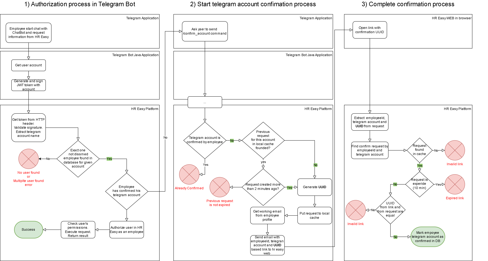

# Telegram Bot for HR Easy

## Telegram Account Setup Procedure

1. **Profile Configuration:**
    - Employee or admin sets up the Telegram account in their profile within the HR Easy web interface.
2. **Initiate Chat:**
    - The employee starts a chat with the Telegram bot and sends a "/confirm_me" request.
3. **Email Confirmation:**
    - HR Easy sends a confirmation URL to the employee's working email, which is set in HR Easy.
4. **Open Confirmation Link:**
    - The employee opens the provided link in any web browser.
5. **Confirmation Process:**
    - Upon opening the link, the Telegram account is marked as confirmed in HR Easy.

## Supported Commands

- **find**
   - Find an employee by display name, email, or Telegram. Optionally specify project and project role.
      - `/find` - Open instructions.
      - `/find Bondin Alexander` - Find a specific employee.
      - `/find Alexander SuperProject` - Find employees associated with a project.

- **my_profile**
   - Provides basic information about yourself.

- **confirm_me**
   - Initiates the Telegram account confirmation process.

## Setup from the scratch

1. Create telegram bot using t.me/BotFather
2. Setup application.yaml section with your values. You can use envoriment variables as well. See [Spring Externalized Configuration](https://docs.spring.io/spring-boot/docs/1.2.2.RELEASE/reference/html/boot-features-external-config.html#boot-features-external-config)
```yaml
hreasy:
  telegram:
    bot-username: "XXX"
    bot-token: "YYY"
    bot-creator: YourAccountId
    platform:
      base_url: "<URL TO HR EASY BACKEND>/telegram/"
```

## Auth and confirmation process in technical details

